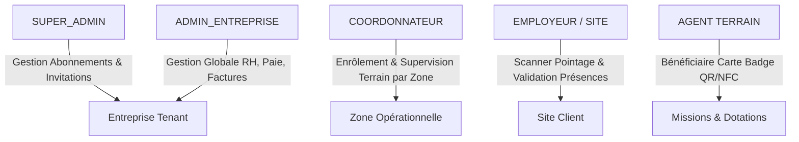
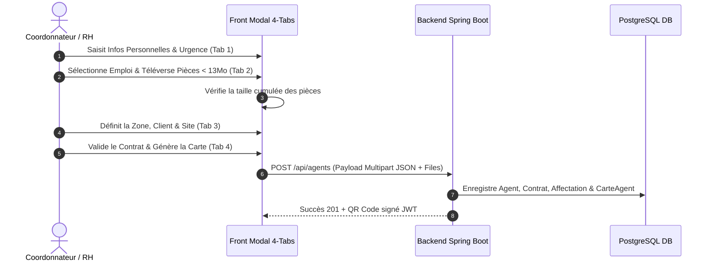
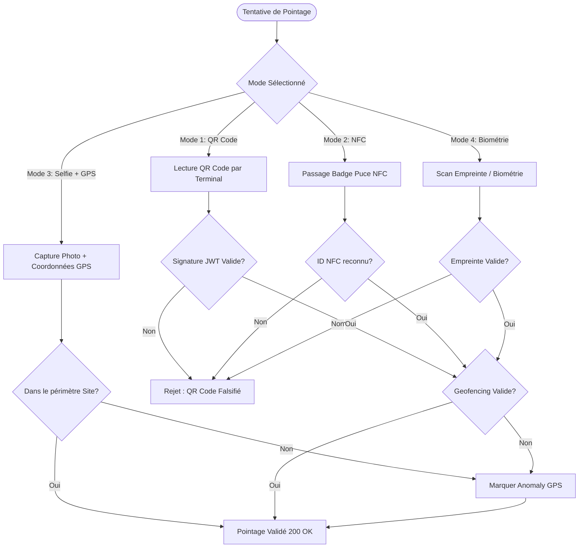
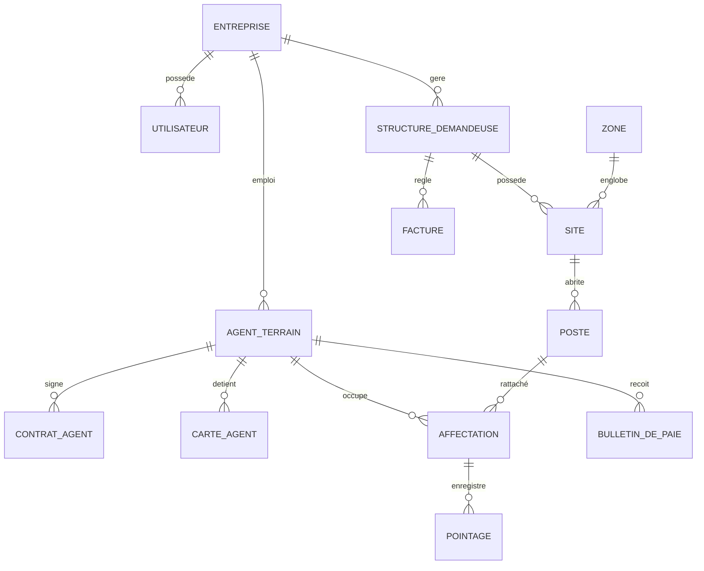

# CAHIER DES CHARGES FONCTIONNEL ET TECHNIQUE COMPLET (CdC)
## Projet : **SimpleTaff - Plateforme SaaS de Gestion du Personnel de Terrain & SIRH**

---

## 1. PRESENTATION DU PROJET ET CONTEXTE

### 1.1 Contexte & Enjeux
Dans les secteurs d'activité mobilisant d'importants effectifs sur le terrain (sécurité privée, nettoyage industriel, BTP, logistique, prestations de services détachées), le suivi des agents en mission représente un défi critique. Les méthodes traditionnelles basées sur le papier ou des feuilles de calcul manuelles entraînent :
* Un risque élevé de fraude sur les présences (pointages de complaisance, usurpation d'identité).
* Des retards et des erreurs dans l'élaboration des bulletins de paie et la facturation des clients.
* Une perte de traçabilité sur les dotations d'équipements et matériels attribués aux agents.
* Une difficulté majeure à anticiper la fin des contrats de travail et l'expiration des pièces administratives (cartes d'identité, visas, aptitudes médicales, certifications).

### 1.2 Objectifs Stratégiques
**SimpleTaff** est une solution logicielle SaaS (Software as a Service) multi-tenant conçue pour numériser, sécuriser et automatiser l'intégralité du cycle de vie des agents de terrain et du personnel sous-traité. 

Les objectifs principaux sont :
1. **Digitalisation intégrale du recrutement et de l'enrôlement** (workflow guidé en 4 étapes avec contrôle des fichiers jusqu'à 13 Mo).
2. **Sécurisation absolue du pointage terrain** à travers un système hybride à 4 modes (QR Code cryptographique signé JWT/HMAC, Puce NFC, Photo Selfie avec horodatage + Géolocalisation GPS Geofencing, et Empreinte Biométrique).
3. **Automatisation de la paie et des cotisations** (CNPS, CNAM, retenues fiscales, primes de terrain, de logement, de transport et de rendement).
4. **Transparence et facturation en temps réel** pour les structures clientes / employeurs sur site.
5. **Gestion proactive des alertes** (expiration automatique des pièces justificatives, contrats et certifications via tâches planifiées).

---

## 2. ARCHITECTURE TECHNIQUE ET EXIGENCES SYSTEME

### 2.1 Stack Technique Standardisée

| Composant | Technologie / Framework | Description & Usage |
| :--- | :--- | :--- |
| **Backend Core** | Java 21 LTS / Spring Boot 3.x | API REST Stateful/Stateless, Business Services, Security Context |
| **Sécurité** | Spring Security & JWT (JSON Web Tokens) | Authentification par jeton Bearer, filtrage RBAC, cryptage HMAC-SHA256 |
| **Persistance** | Spring Data JPA / Hibernate | ORM avec gestion des entités et relations relationnelles complexes |
| **Base de Données** | PostgreSQL | SGBDR relationnel avec prise en charge des types UUID et JSONB |
| **Gestion des Migrations**| Flyway Migration | Versionnement strict du schéma SQL (`V1__` à `V17__`) |
| **Tâches Planifiées** | `@EnableScheduling` (Spring Task) | Schedulers d'alertes automatiques et nettoyage des sessions |
| **Frontend** | HTML5 / Vanilla CSS3 / JavaScript ES6+ | SPA (Single Page Application) par rôle avec design responsive et Glassmorphism |
| **Bibliothèques UI** | Material Icons, FontAwesome, Chart.js | Iconographie professionnelle et données graphiques réactives |

### 2.2 Modèle Multi-Tenant & Isolation des Données
La plateforme garantit une étanchéité stricte des données entre les différentes entreprises prestataires (Tenants).
* Chaque requête API authentifiée extrait le `tenant_id` (`entreprise_id`) à partir du contexte du jeton JWT (`TenantService`).
* Les entités métier (`AgentTerrain`, `ContratAgent`, `Pointage`, `Facture`, `Materiel`, etc.) sont systématiquement associées à une référence `Entreprise`.
* Un filtre de sécurité de niveau base de données ou service empêche tout accès croisé entre deux entreprises clientes.

---

## 3. MATRICE DES ROLES ET DROITS D'ACCES (RBAC)

La plateforme s'articule autour de 5 profils d'utilisateurs distincts :



### 3.1 Description des Rôles

1. **SUPER_ADMIN (Gestionnaire SaaS)** :
   * Administration globale des comptes entreprises (création, suspension, résiliation).
   * Envoi d'invitations sécurisées par e-mail avec jeton d'activation.
   * Définition des formules d'abonnement et supervision de la santé globale de la plateforme.

2. **ADMIN_ENTREPRISE (Directeur RH / Gérant Prestataire)** :
   * Accès complet à l'espace `admin-entreprise`.
   * Paramétrage des référentiels (catalogue des emplois, grilles salariales, matériel, règles de prime de rendement).
   * Validation finale des contrats de travail et délivrance des cartes agents.
   * Clôture de la paie, calcul des bulletins et émissions des factures clients.
   * Consultation du journal d'audit (`AuditLog`).

3. **COORDONNATEUR (Chef d'Exploitation / Responsable de Zone)** :
   * Accès à l'espace `coordonnateur`.
   * Enrôlement des nouveaux agents sur le terrain via le formulaire 4-onglets.
   * Affectation des agents sur les zones opérationnelles et attribution des matériels de zone.
   * Supervision en temps réel des pointages et anomalies de présence.
   * Saisie des demandes de dotation pour les agents de sa zone.

4. **EMPLOYEUR / STRUCTURE DEMANDEUSE (Client Final / Chef de Site)** :
   * Accès à l'espace `employeur`.
   * Utilisation du module de pointage hybride (Scanner QR Code, lecteur NFC, validation photo).
   * Validation des entrées/sorties quotidiennes des agents détachés sur ses sites.
   * Consultation des rapports de présence consolidés et téléchargement des factures.

5. **AGENT TERRAIN (Personnel Opérationnel)** :
   * Déteneur d'un badge physique ou numérique doté d'un QR Code cryptographique et/ou puce NFC.
   * Réception des ordres de mission et accusés de réception de dotations.

---

## 4. SPECIFICATIONS FONCTIONNELLES DETAILLEES PAR MODULE

### 4.1 Module 1 : Enrôlement et Dossier Unique de l'Agent

#### 4.1.1 Processus d'Enrôlement Guidé en 4 Etapes (Modal 4-Tabs)
L'enrôlement d'un agent suit un workflow strict empêchant la création de dossiers incomplets :

* **Onglet 1 : Informations Personnelles & Contacts d'Urgence**
  * Saisie de l'état civil (Nom, Prénom, Date de naissance, Genre, Contact téléphonique principal et secondaire).
  * Situation matrimoniale et nombre d'enfants à charge (nécessaires au calcul des abattements CNPS/Fiscalité).
  * Contact d'urgence obligatoire (Nom, Téléphone, Lien de parenté).
  * Photo d'identité récente (formats autorisés : PNG, JPG, WEBP).

* **Onglet 2 : Emploi, Spécialité & Pièces Justificatives**
  * Sélection du poste/emploi dans le catalogue référentiel de l'entreprise.
  * Sélection de la commune et zone opérationnelle de rattachement (référentiel officiel Côte d'Ivoire).
  * Téléversement des pièces administratives obligatoires (CNI/Passeport, Attestation CNPS, Certificat médical, Extrait de casier judiciaire, Diplômes/Certifications).
  * **Contrainte technique** : Contrôle dynamique de la taille cumulée des fichiers (Plafond strict fixée à 13 Mo) avec alerte visuelle en temps réel.

* **Onglet 3 : Affectation Initiale & Structure Cliente**
  * Définition de la structure cliente d'accueil et du site d'intervention.
  * Saisie de la date d'effet de l'affectation et du motif d'occupation.

* **Onglet 4 : Génération Contractuelle & Carte Badge QR/NFC**
  * Choix du type de contrat (CDD, CDI, Prestation, Intérim).
  * Calcul automatique du salaire brut négocié selon l'emploi sélectionné.
  * Génération de la fiche synthétique au format PDF.
  * Création automatique d'une entité `CarteAgent` associée.



---

### 4.2 Module 2 : Gestion Contractuelle, Referentiels & Pièces Administratives

#### 4.2.1 Référentiel des Emplois et Grilles Salariales
* Définition des libellés d'emploi, catégories professionnelles, compétences requises et salaire brut de référence.
* Chaque poste créé au sein d'un site client hérite des règles définies dans le catalogue d'emploi de l'entreprise.

#### 4.2.2 Suivi des Pièces Justificatives & Alertes automatiques
* Chaque pièce enregistrée possède une date d'émission, une date d'expiration et une URL de stockage.
* **Tâche planifiée (`ExpirationScheduler`)** : Exécutée quotidiennement à minuit pour :
  * Identifier les pièces et contrats expirant dans un délai de 30 jours, 15 jours et 7 jours.
  * Générer une notification système (`NotificationEvenement`) et envoyer une alerte e-mail au service RH.
  * Mettre à jour le statut du document (`EXPIRANT`, `EXPIRE`).

---

### 4.3 Module 3 : Affectations, Sites Clients & Missions Terrain

#### 4.3.1 Structure Client & Gestion des Sites
* Enregistrement des structures demandeuses (Raison sociale, secteur d'activité, contacts).
* Création des sites rattachés aux structures clientes avec indication de la commune, adresse physique et zone géolocalisée.

#### 4.3.2 Planning des Missions & Géolocalisation
* Création de missions ponctuelles ou récurrentes attribuées à des agents affectés.
* Définition du périmètre d'intervention avec coordonnées GPS (Latitude, Longitude) et objectifs à atteindre.
* Horodatage du démarrage et de la fin effective de la mission.

---

### 4.4 Module 4 : Système de Pointage Hybride à 4 Modes

Le module de pointage constitue le cœur de la validation opérationnelle. Il propose 4 modes de capture selon l'équipement disponible sur site :



#### 4.4.1 Les 4 Modes de Pointage
1. **Mode QR Code Cryptographique** : Scan du code QR affiché sur le badge de l'agent. Le QR Code n'est pas un simple texte brut mais une chaîne signée cryptographiquement (HMAC-SHA256) intégrant l'ID agent, la date d'émission et une signature d'intégrité anti-falsification.
2. **Mode Puce NFC** : Approche d'un badge à puce RFID/NFC près du lecteur ou smartphone employeur. Le système interroge le numéro de série d'usine de la carte (`identifiant_nfc`).
3. **Mode Photo Selfie + Géolocalisation GPS** : Prise de vue en direct du visage de l'agent associée au relevé GPS de l'appareil. Le backend contrôle l'écart géographique par rapport aux coordonnées du site client (Geofencing).
4. **Mode Empreinte Biométrique** : Synchronisation avec un lecteur biométrique physique transmettant l'identifiant biométrique sécurisé (`source_biometrie`).

#### 4.4.2 Calcul Automatique des Présences et Anomalies
Chaque enregistrement de pointage (Entrée/Sortie) déclenche les calculs suivants :
* **Durée de travail** (en minutes et heures effectives).
* **Détection de retard** par rapport à l'heure théorique de prise de poste.
* **Détection d'anomalies** (Heures supplémentaires non planifiées, sortie anticipée, absence de pointage de sortie, déviation GPS hors zone).

---

### 4.5 Module 5 : Paie, Primes & Cotisations Socialement Conformes

Le module de paie transforme les données de présence validées en bulletins de paie complets.

#### 4.5.1 Structure du Bulletin de Paie (`BulletinDePaie`)
* **Éléments Bruts** :
  * Salaire de base contractuel proratisé au nombre de jours validés.
  * Primes fixes : Transport, Logement, Terrain, Communication, Panier.
  * Prime d'ancienneté (calculée automatiquement selon la date d'embauche).
  * **Prime de Rendement Paramétrable** : Définie par une règle entreprise (`ReglePrimeRendement`) liant les évaluations de performance et le respect des pointages au versement d'un montant par point.

* **Déductions Légales & Cotisations (Conformité CNPS & CNAM)** :
  * Cotisation CNPS (Caisse Nationale de Prévoyance Sociale - Part Salariale).
  * Cotisation CNAM (Caisse Nationale d'Assurance Maladie).
  * Impôt sur le Revenu Sécurisé / Retenue à la source.

* **Retenues Spécifiques** :
  * Retenues pour absences injustifiées (calculées selon le paramètre `taux_retenue_reduite` ou jours secs).
  * Déductions pour avances sur salaire et assurances de groupe.

```math
\text{Salaire Net} = (\text{Base Effectif} + \sum \text{Primes}) - (\text{CNPS} + \text{CNAM} + \text{Impôt} + \text{Retenues Absences} + \text{Avances})
```

---

### 4.6 Module 6 : Facturation des Structures Clientes

#### 4.6.1 Génération Automatisée des Factures
* Regroupement mensuel ou périodique des affectations d'agents par structure cliente.
* Calcul du montant total facturé en combinant le tarif négocié du poste, le nombre de jours d'occupation effective et les prestations annexes.
* Génération du rapport de pointage consolidé joint à la facture (`rapport_pointage_url`).
* Suivi des états de paiement (`EN_ATTENTE`, `PAYEE`, `EN_RETARD`, `PARTIEL`).

---

### 4.7 Module 7 : Dotation et Gestion du Matériel

#### 4.7.1 Inventaire et Affectation Matériel
* Registre du matériel d'entreprise (Smartphones, terminaux de pointage, uniformes, équipements de protection individuelle, cartes SIM).
* Suivi par numéro de série, catégorie, valeur d'achat et opérateur/forfait.
* Attributions aux agents avec capture de la **signature électronique d'émargement** lors de la remise et de la restitution.
* Workflow de demande de dotation initié par les coordonnateurs de zone.

---

### 4.8 Module 8 : Congés et Absences

#### 4.8.1 Typologie des Absences & Demandes de Congé
* Gestion des types : Congé payé annuel, congé de maternité, maladie, évènement familial, absence autorisée.
* Calcul en temps réel du solde de congé restant (`SoldeConge`).

#### 4.8.2 Workflow en 3 Etapes pour les Absences Injustifiées
1. **Constat automatique** : Pointage manquant non régularisé sous 24h.
2. **Notification & Demande d'explication** : Envoi d'un message automatique à l'agent avec délai de justification de 48h.
3. **Validation / Saisie Sanction** : Classification par la RH en absence justifiée (courte/longue) ou basculement en dossier disciplinaire.

---

### 4.9 Module 9 : Discipline & Évaluation des Performances

#### 4.9.1 Module Disciplinaire
* Traçabilité des avertissements, blâmes, mises à pied conservatoires ou disciplinaires, et ruptures de contrat pour faute.
* Stockage des documents officiels de décision (`decision_url`).

#### 4.9.2 Évaluation Annuelle / Périodique à 8 Critères
Chaque agent est évalué selon une grille standardisée notée de 1 à 5 sur 8 axes majeurs :
1. **Ponctualité**
2. **Discipline & Présentation**
3. **Qualité du travail**
4. **Productivité**
5. **Esprit d'équipe**
6. **Respect des procédures de sécurité**
7. **Satisfaction client / employeur**
8. **Communication**

Le score total (sur 40 ou converti sur 100) alimente le radar de compétences et le calcul des primes de rendement.

---

### 4.10 Module 10 : Journal d'Audit, Sécurité & Reporting

#### 4.10.1 Journal d'Audit Système (`AuditLog`)
Toute action critique réalisée sur la plateforme est inscrite de manière inaltérable dans la table `audit_log` :
* Horodatage précis (`cree_le`).
* Identifiant de l'utilisateur et rôle.
* Module concerné (`AGENTS`, `PAIE`, `POINTAGE`, `CONTRATS`, `FACTURES`).
* Action exécutée (`CREATION`, `MODIFICATION`, `SUPPRESSION`, `VALIDATION`).
* Empreinte textuelle des modifications (`details`).

#### 4.10.2 Module de Reporting et Exports
* Génération de bilans mensuels de présence.
* Exportation des données aux formats **PDF** (fiches agents, factures, bulletins) et **Excel XLSX** (registres de paie, récapitulatifs de pointage).

---

## 5. DICTIONNAIRE DES DONNEES ET BASE DE DONNEES (SCHEMA SQL)

La base de données repose sur 38 tables relationnelles optimisées. Les entités maîtresses sont représentées ci-dessous :



### 5.1 Extrait des Tables Clés et Leurs Attributs

#### 1. Table `entreprise` (Tenant SaaS)
* `id` (UUID, PK)
* `nom` (VARCHAR) - Raison sociale de l'entreprise prestataire
* `email` (VARCHAR) - E-mail officiel du compte
* `statut` (VARCHAR) - `ACTIF`, `SUSPENDU`
* `formule_abonnement` (VARCHAR) - `STANDARD`, `PREMIUM`, `ENTERPRISE`
* `taux_cotisation` (NUMERIC) - Taux légal par défaut
* `taux_retenue_reduite` (NUMERIC) - Taux d'abattement pour absences

#### 2. Table `agent_terrain` (Personnel Opérationnel)
* `id` (UUID, PK)
* `entreprise_id` (UUID, FK -> `entreprise`)
* `zone_id` (UUID, FK -> `zone`)
* `nom` (VARCHAR), `prenom` (VARCHAR), `contact` (VARCHAR)
* `telephone_secondaire` (VARCHAR)
* `situation_matrimoniale` (VARCHAR), `nombre_enfants` (INT4)
* `contact_urgence_nom`, `contact_urgence_telephone`, `contact_urgence_lien` (VARCHAR)
* `statut` (VARCHAR) - `EN_ATTENTE_VALIDATION`, `EN_SERVICE`, `SUSPENDU`, `INACTIF`

#### 3. Table `carte_agent` (Badge QR/NFC)
* `id` (UUID, PK)
* `agent_id` (UUID, FK -> `agent_terrain`)
* `code_qr` (TEXT) - Jeton cryptographique signé JWT/HMAC
* `identifiant_nfc` (TEXT) - UID de la puce NFC physique
* `source_biometrie` (TEXT) - Empreinte vectorielle
* `statut` (VARCHAR) - `ACTIF`, `BLOQUE`, `PERDU`

#### 4. Table `pointage` (Horodatage Hybride)
* `id` (UUID, PK)
* `entreprise_id` (UUID, FK -> `entreprise`)
* `affectation_id` (UUID, FK -> `affectation`)
* `carte_scannee_id` (UUID, FK -> `carte_agent`)
* `date_heure_entree` (TIMESTAMP), `date_heure_sortie` (TIMESTAMP)
* `mode` (VARCHAR) - `QR_CODE`, `NFC`, `PHOTO_GPS`, `BIOMETRIE`
* `latitude_entree`, `longitude_entree`, `latitude_sortie`, `longitude_sortie` (NUMERIC)
* `selfie_url` (VARCHAR)
* `anomalie` (TEXT) - Description des retards ou écarts de zone

#### 5. Table `bulletin_de_paie` (Rétribution & Cotisations)
* `id` (UUID, PK)
* `entreprise_id`, `agent_id`, `affectation_id` (UUID, FK)
* `periode` (VARCHAR) - Format `YYYY-MM`
* `jours_prevus`, `jours_valides`, `jours_absence_non_justifiee` (INT4)
* `salaire_brut_effectif` (NUMERIC), `salaire_net_calcule` (NUMERIC)
* `cotisation_cnps` (NUMERIC), `cotisation_cnam` (NUMERIC), `impot_sur_revenu` (NUMERIC)
* `prime_transport`, `prime_logement`, `prime_terrain`, `total_primes` (NUMERIC)

---

## 6. SPECIFICATIONS DES INTERFACES ET APPLICATION APPLICATION (API REST)

L'ensemble des échanges entre le frontend HTML/JS et le backend Java s'effectue via des endpoints REST sécurisés au format JSON.

### 6.1 Matrice des Endpoints Majeurs

| Module | Méthode | URI Endpoint | Description & Résultat |
| :--- | :--- | :--- | :--- |
| **Auth** | `POST` | `/api/auth/login` | Authentification utilisateur & retour Jeton JWT Bearer |
| **Auth** | `GET` | `/api/auth/me` | Profil et droits de l'utilisateur connecté |
| **Agents** | `GET` | `/api/agents` | Liste filtrée des agents de l'entreprise |
| **Agents** | `POST` | `/api/agents` | Enrôlement complet (multipart: JSON + Fichiers < 13 Mo) |
| **Agents** | `GET` | `/api/agents/{id}/badge` | Extrait du badge QR Code signé & PDF d'impression |
| **Pointage** | `POST` | `/api/pointage/scanner` | Scan d'un QR code / NFC avec validation en temps réel |
| **Pointage** | `POST` | `/api/pointage/valider` | Validation manuelle entrée/sortie par l'employeur |
| **Missions** | `POST` | `/api/missions` | Création d'une mission géolocalisée pour un agent |
| **Paie** | `POST` | `/api/paie/calculer` | Génération et clôture des bulletins de paie du mois |
| **Facturation**| `POST` | `/api/factures/generer` | Émission d'une facture pour une structure cliente |
| **Dotation** | `POST` | `/api/dotations/affecter` | Remise d'un matériel avec signature électronique |
| **Audit** | `GET` | `/api/audit-logs` | Journal des événements et actions d'administration |

---

## 7. EXIGENCES NON FONCTIONNELLES

### 7.1 Exigences de Sécurité
1. **Protection des Données Personnelles** : Chiffrement des mots de passe en base via bcrypt.
2. **Intégrité des QR Codes** : Interdiction d'utiliser des identifiants statiques bruts en QR code. Chaque code QR produit doit résulter d'une signature cryptographique incorporant un horodatage et une clé secrète serveur.
3. **Contrôle d'Accès Strict** : Validation systématique du rôle (`SUPER_ADMIN`, `ADMIN_ENTREPRISE`, `COORDONNATEUR`, `EMPLOYEUR`) sur chaque route API via Spring Security Annotations (`@PreAuthorize`).
4. **Protection du Réseau** : Configuration de filtres CORS stricts et protection contre les attaques XSS et CSRF.

### 7.2 Exigences de Performance et Scalabilité
1. **Temps de Réponse API** : Sub-300ms pour les opérations de pointage et de lecture des listes.
2. **Traitement Fichiers** : Optimisation du téléversement des pièces d'enrôlement avec traitement asynchrone et validation en amont du quota cumulé de 13 Mo.
3. **Optimisation Base de Données** : Indexation des clés étrangères et des colonnes fréquemment requêtées (`entreprise_id`, `agent_id`, `date_heure_entree`, `statut`).

### 7.3 Ergonomie et Aesthetique Visual (UI/UX)
1. **Design System Épuré** : Palette de couleurs modernes (Mode sombre profond / Thème clair professionnel, touches de dégradés bleu et émeraude, composants Glassmorphism).
2. **Standardisation Typographique & Composants** : Alignement strict des grilles, retours d'information par badges d'état couleur (Vert: Valide/Actif, Orange: En attente/Expirant, Rouge: Anomolie/Expiré/Bloqué).
3. **Adaptabilité** : Interface entièrement responsive supportant les ordinateurs de bureau, tablettes et terminaux mobiles de terrain.

---

## 8. PLAN DE RECETTE ET CRITERES D'ACCEPTATION

Pour prononcer la recette définitive du projet **SimpleTaff**, les tests d'acceptation suivants doivent être validés à 100% :

| Test ID | Libellé du Test | Procédure de Validation | Critère de Succès |
| :--- | :--- | :--- | :--- |
| **TC-01** | Isolation Multi-Tenant | Connexion avec deux entreprises distinctes A et B. | L'entreprise A ne voit aucun agent ou document de B. |
| **TC-02** | Quota Fichiers Enrôlement | Téléversement de pièces administratives totalisant 14 Mo. | Rejet immédiat par le front et le back me message explicite. |
| **TC-03** | Pointage QR Code Signé | Scan d'un badge imprimé avec QR signé JWT. | Validation instantanée, création du pointage et affichage photo. |
| **TC-04** | Détection Fraude GPS | Tentative de pointage Selfie à 5 km du site affecté. | Marquage automatique du pointage avec statut "ANOMALIE_GPS". |
| **TC-05** | Tâche Planifiée Expiration | Modification manuelle d'une pièce d'identité à J+5 de l'expiration. | Génération automatique d'une alerte RH par le Scheduler. |
| **TC-06** | Calcul Paie & CNPS | Clôture de la paie pour un agent ayant 2 jours d'absence injustifiée. | Déduction exacte sur le salaire brut effectif et calcul CNPS conforme. |

---

## 9. CONCLUSION

Ce cahier des charges constitue la référence fonctionnelle et technique absolue du projet **SimpleTaff**. Il définit les règles de gestion métier, l'architecture logicielle, la structure des données et les exigences de sécurité nécessaires pour garantir une solution robuste, évolutive et immédiatement opérationnelle pour la gestion du personnel de terrain.
